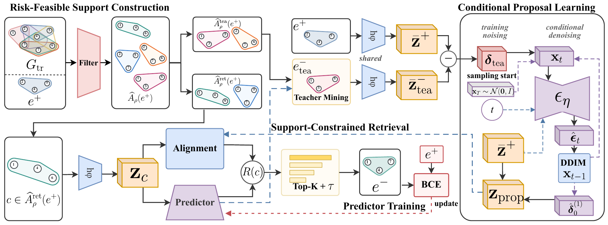

# SCANS: Support-Constrained Adaptive Negative Sampling

[](https://github.com/Jimmyverysix/open-SCANS/actions/workflows/ci.yml)
[](LICENSE)
[](https://www.python.org/)

This repository contains the official implementation of **SCANS** (**S**upport-**C**onstrained **A**daptive **N**egative **S**ampling) for hyperedge prediction. SCANS decouples candidate eligibility from training value: structural risk constraints first define a risk-feasible support, after which a conditional diffusion proposal and the current predictor's hardness guide negative retrieval within that support.

<p align="center">
  
</p>

The publication-quality vector version is available as [`scans_overview.pdf`](docs/assets/scans_overview.pdf).

## Method

For each observed positive hyperedge, SCANS performs four stages:

1. **Risk-feasible support construction** excludes observed positives and candidates that violate the structural risk constraints.
2. **Conditional proposal learning** mines a teacher negative and learns its normalized residual relative to the positive hyperedge through conditional diffusion.
3. **Support-constrained retrieval** combines proposal alignment with predictor hardness to rank real candidate hyperedges inside the feasible support.
4. **Predictor training** samples cardinality-matched negatives from a temperature-scaled top-*K* distribution and updates the hyperedge predictor.

The diffusion model supplies a continuous, positive-conditioned search direction. It does not bypass the candidate support or directly replace the retrieved negative hyperedge.

## Repository structure

```text
open-SCANS/
├── src/scans/                  # SCANS models, samplers, training, and evaluation
├── scripts/run_scans_benchmark.py
│                                # main training and evaluation entry point
├── tests/                       # unit and experiment-semantics tests
├── docs/assets/                 # paper overview in PDF and README preview
└── pyproject.toml               # package metadata and dependencies
```

The public repository intentionally focuses on the proposed method and its main execution path. Internal experiment orchestration, ablation/sensitivity launchers, raw logs, checkpoints, and manuscript sources are not included.

## Installation

SCANS requires Python 3.11 or later. A CUDA-enabled PyTorch installation is recommended for benchmark experiments, while the self-check and test suite can also run on CPU.

```bash
git clone https://github.com/Jimmyverysix/open-SCANS.git
cd open-SCANS
python -m venv .venv
source .venv/bin/activate          # Windows: .venv\Scripts\activate
python -m pip install --upgrade pip
python -m pip install -e ".[dev]"
```

Validate the installation without downloading a dataset:

```bash
python scripts/run_scans_benchmark.py --self-check
python -m pytest -q
```

## Data

The benchmark datasets are third-party research assets and are not redistributed in this repository. After obtaining a dataset from its original source, store it as a whitespace-separated hyperedge list with one hyperedge per line:

```text
0 4 9
1 3 7 12
2 5
```

Dataset keys and expected local paths are defined in `src/scans/data/benchmark.py`. The runner uses the same 60/20/20 train/validation/test split and cardinality-matched negative evaluation protocol described in the paper.

## Running SCANS

Run the following command from the repository root after preparing the selected dataset:

```bash
python scripts/run_scans_benchmark.py \
  --datasets cora \
  --methods hypergcn \
  --modes scans_full \
  --seeds 100 \
  --devices 0
```

Use `python scripts/run_scans_benchmark.py --help` for the complete configuration interface. Generated logs, checkpoints, and result files are written to ignored local directories and are not committed to Git.

## Citation

If you use SCANS, please cite the accompanying manuscript:

```bibtex
@article{yang2026scans,
  title  = {SCANS: Support-Constrained Adaptive Negative Sampling for Hyperedge Prediction},
  author = {Yang, Jinming and Deng, Zhenyu and Cai, Shimin and Zhou, Tao},
  year   = {2026},
  note   = {Manuscript}
}
```

## License

The source code is released under the [MIT License](LICENSE). Third-party datasets remain subject to their respective licenses and terms of use.
